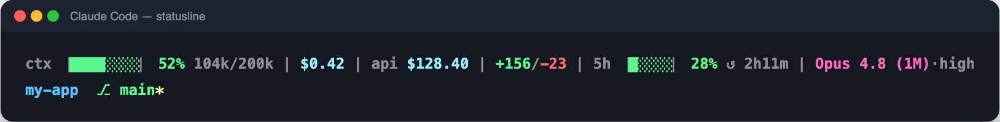

# agent-config-harness

[](https://github.com/damson/agent-config-harness/actions/workflows/ci.yml)
[](https://codecov.io/gh/damson/agent-config-harness)
[](https://github.com/damson/agent-config-harness/releases)
[](LICENSE)
[](#-score-your-config-in-ci)

**Agent instruction files, scored and regression-tested like code.**

Hi 👋 — you know that `CLAUDE.md` you wrote six months ago? The one every agent
session silently reads before touching your code? When did you last *measure*
it?

`CLAUDE.md`, `AGENTS.md`, `.cursorrules` and skill definitions steer how coding
agents behave, and they are usually maintained the way prompts are maintained:
edited by feel, never measured, quietly rotting. This repo treats them as
something you can grade, track, and break a build over — and yes, your config
gets a report card:

```
$ just eval backend-node
ℹ Scoring domain: backend-node
✔ Result written: evals/results/2026-08-29-backend-node.json
ℹ   Total: 24/25  Grade: A
ℹ   Findings (5):
    - [completeness] No build/run/verify commands. An agent cannot tell how to
      install, typecheck, lint or run the test suite before claiming a change works.
    - [clarity] Logging: `requestId` propagation is required but the mechanism is
      unspecified — AsyncLocalStorage vs an explicit context argument produces
      very different code.
    …
```

That is a real run against the example domain in this repo, not an illustration.

Three things make that possible, and they are the reason this exists:

| | |
|---|---|
| 🎯 **A rubric with a number** | Config files are scored 1–5 on clarity, conciseness, completeness, consistency and actionability. Out of 25, with a letter grade and specific findings — not a vibe. The rubric is [a readable prompt](evals/prompts/config-quality.md), so you can see exactly what "good" means. |
| 📈 **A trend, not a snapshot** | Scores are [recorded per domain over time](docs/evaluation.md#trend-reports), so you can tell an improvement from a rewrite that felt productive. |
| 🧪 **Structural tests** | A [`bats` suite](tests/) enforces the invariants a rubric cannot see: skill frontmatter matching its folder, required headings, unique names across a flat install namespace, no symlink silently turned back into a duplicate file. |

## 👀 See a real grade in sixty seconds — no key needed

Scoring your *own* config calls the API (the eval shells out to the Claude CLI
and needs an `ANTHROPIC_API_KEY`), but seeing what a grade looks like costs
nothing: two real, committed eval runs ship with the repo. Everything that
isn't an eval — linking, health checks, the test suite — runs offline too.

<details>
<summary>🅰️ vs 🅵 — the same config, one edit apart (click me)</summary>

[`evals/examples/`](evals/examples/) holds two real, committed eval runs:
[`scored-A.json`](evals/examples/scored-A.json) is the shipped example config
(24/25), and [`scored-F.json`](evals/examples/scored-F.json) is
[`degraded.md`](evals/examples/degraded.md) — the same config plus two sections
of familiar rot: a platitude section hiding a contradiction, and an "important
reminders" block restating seven rules verbatim (13/25). Diff the two findings
lists and watch the rubric name every sin.

</details>

## 🎓 Score your config in CI

The rubric is also a [GitHub Action](action.yml) — this repo doubles as one.
Point it at any repo's `CLAUDE.md` and the build fails when config quality
slips below a grade.
Your instruction files get the same treatment as your code: reviewed by a
machine with opinions.

```yaml
jobs:
  config-eval:
    runs-on: ubuntu-latest
    timeout-minutes: 10
    steps:
      - uses: actions/checkout@v4
      - uses: damson/agent-config-harness@v1
        env:
          ANTHROPIC_API_KEY: ${{ secrets.ANTHROPIC_API_KEY }}
        with:
          files: CLAUDE.md      # comma-separated; or `domain:` for consumer repos
          fail-below: C         # the job fails only below this grade
```

Pin the action to a tag or a commit SHA, never a branch — a mutable ref means
your CI runs whatever that ref points at tomorrow.

The score and findings land in the job summary. Remember the eval moves ±1–2 on
borderline scores — gate on the grade you can live with, not the one you are
proud of.

And treat the gate as an advisory signal, not a security control: the grade
comes from an LLM reading the PR author's own file, so a determined author can
steer their grade with content addressed to the evaluator. It catches drift
and sloppiness, not adversaries.

## 🚀 Install

Prerequisites: `git`, [`just`](https://github.com/casey/just),
[`bats`](https://github.com/bats-core/bats-core), `jq`, and the
[`claude` CLI](https://docs.anthropic.com/en/docs/claude-code). Only the eval
commands call the API and need an `ANTHROPIC_API_KEY`; everything else runs
offline.

```bash
git clone https://github.com/damson/agent-config-harness.git ~/workspace/agent-config-harness
cd ~/workspace/agent-config-harness
just setup      # symlink configs and skills into ~/.claude/, install git hooks
just check      # verify every link and domain resolves
just test       # the bats suite
```

`just setup` is idempotent and unattended: it never prompts, never installs
third-party software, and backs up any real file it would replace with a
symlink. Run it from the primary checkout, not from a git worktree — it points
every skill symlink at the repo root, and a worktree path dies with the
worktree.

## 🧩 The idea: domains

A **domain** is a kind of project — mobile, backend, frontend, data. Each one owns
a config file, and [the registry](config/domains.conf) says where it lives and
what is managed:

```
# config/domains.conf
mobile      = workspace/mobile   : AGENTS.md>project/CLAUDE.md, CLAUDE.md, .cursorrules
web-react   = workspace/web-react, workspace/web : CLAUDE.md
```

Adding a domain means appending one line. No script reads a hardcoded path;
everything goes through the registry via [`lib/common.sh`](lib/common.sh).

`CLAUDE.md` is the single source of truth per domain. The `AGENTS.md` beside it is
a **symlink**, so tools that read one or the other resolve identical content and
cannot drift. Turning that symlink back into a real file is the most common way
to tank a domain's score, and the test suite fails when it happens.

The `A > B` syntax maps a file the project calls `A` to `B` inside this repo — for
when a project's `AGENTS.md` is your `project/CLAUDE.md`.

## 🥞 Layers

```
user-pers/        identity — who you are, how the agent writes as you
user-dev/         your global rules + your skills, loaded in every project
workspace/<d>/    per-domain rules, loaded when you work in that domain
  project/        the layer a whole team agrees, kept separate from yours
```

The split matters because the layers have different owners and different
lifetimes. Your commit-message preference is not your team's architecture rule,
and mixing them makes both harder to change. The four-layer pipeline behind all
of this is mapped in [docs/architecture.md](docs/architecture.md).

## 📊 Statusline

[`user-dev/statusline.sh`](user-dev/statusline.sh) renders the Claude Code
prompt line. `just setup` links it to `~/.claude/statusline.sh` and wires it
into `~/.claude/settings.json` as the `statusLine` command. It reads the
session JSON Claude Code pipes on stdin (requires `jq`; without it only the
location line renders) and prints two lines — metrics first, location second:



*(A real render of the script, fed a sample session JSON — not a mock-up.)*

Line 1 segments, in order, joined by ` | `:

| Segment | Shows |
|---|---|
| `ctx` | Context-window bar (8 cells), % used, tokens used / window size compacted (`104k`, `1.2M`) |
| `$` | Estimated session cost, USD |
| `api $` | Org month-to-date API spend — optional, see below |
| `+/-` | Lines added (green) / removed (red) this session |
| `5h` | 5-hour rate-window bar (5 cells), % used, `↺` reset countdown (`2h11m`, `44m`, `now`) |
| model | Display name (magenta) · reasoning effort when not `medium`, or `⚡` in fast mode; output style appended when not `default` |

Line 2 is the working directory's basename (blue) and the git branch (green),
with a yellow `*` when the tree is dirty. Bars and percentages colour by load:
green below 60%, yellow below 85%, red at 85% and above. Labels and separators
are grey, costs cyan. Every field in the stdin schema is optional — a segment
self-hides when its data is absent.

The `api $` segment stays dormant unless an Anthropic Admin key is provided via
`$ANTHROPIC_ADMIN_KEY` or `~/.claude/anthropic_admin_key` (keep the keyfile
`chmod 600`). It sums the org's month-to-date Admin cost report, cached and
refreshed by a detached background fetch about every 15 minutes — the render
itself never blocks on the network.

## 🧰 Commands

Everything is driven through [`just`](Justfile) — run bare `just` to list these:

| Command | What it does |
|---|---|
| `just setup` | Link configs and skills globally; install git aliases and pre-push hook |
| `just check` | Health-check every link and registered domain |
| `just test` | Full `bats` suite |
| `just lint` | Scan for secret value patterns |
| `just eval [domain]` | Score config quality. Needs the Claude CLI |
| `just eval-skills [skill]` | Score a skill against the skill rubric |
| `just benchmark` | Print the score trend per domain |
| `just skills-install` | Install third-party skill bundles from the registry |
| `just marketplaces-status` | What skill marketplaces are registered, and what is installed |
| `just marketplaces-install` | Add registered marketplaces and install their plugins |
| `just validate-skills [dir]` | Structural check on a skills tree |
| `just validate-marketplace <id>` | Structural check on a marketplace's installed skills |
| `just eval-marketplace <id>` | Score a marketplace's skills on the rubric |
| `just release` / `just backmerge` | Open the release and back-merge PRs. Never merges |

## 🛍️ Skills, and marketplaces

Portable skills live in **Claude Code marketplaces**, not in this repo. What this
repo provides is the part a marketplace does not: a registry so the set is
reproducible, and checks that hold someone else's skills to the same standard as
your own.

```bash
just marketplaces-install             # add registered marketplaces, install their plugins
just validate-marketplace <id>        # structural check on the skills it installed
just eval-marketplace <id> [plugin]   # score them on the skill rubric
```

Register one with a line in [`config/marketplaces.conf`](config/marketplaces.conf):

```
hard-won-skills = damson/hard-won-skills :: * :: https://github.com/damson/hard-won-skills
```

> 🛒 **Looking for skills to install?** That example is real:
> [**hard-won-skills**](https://github.com/damson/hard-won-skills) is this
> repo's sibling marketplace — hard-won habits for Claude Code, in themed
> plugins of battle-earned skills, each extracted from a real session where
> not having it cost something. It is also the guinea pig this harness's
> marketplace checks were built against.

`bin/validate-skills.sh` enforces, on any skills tree — yours or a marketplace's:
frontmatter `name` matching the folder, a non-empty `description`, a `## Procedure`
(or `## Step N`) section, a **`## When to STOP`** section, and leaf names unique
across groups because skills install *flat* into `~/.claude/skills/` and share one
namespace. It reports every problem rather than the first.

`user-dev/skills/` keeps only skills coupled to this repo's own tooling — today
`refresh-domain-benchmark`, which drives `evals/run-eval.sh` and reads
`config/domains.conf`. A skill that would work anywhere belongs in a marketplace,
and keeping it in both places puts two copies under one name in `~/.claude/skills/`.

Full guide with worked examples: [docs/marketplaces.md](docs/marketplaces.md).

## 🚫 What this is not

- **Not a prompt library.** It is the machinery for maintaining your own.
- **Not a Claude-only tool**, though that is what it is tested against. The
  symlinked `AGENTS.md` layer exists so other harnesses resolve the same content.
- **Not turnkey.** The domains shipped here are examples with real structure and
  placeholder content. Replace them; the tests will tell you when you have broken
  something.

## 📚 Documentation

- [Architecture](docs/architecture.md) — the four layers in depth
- [Evaluation](docs/evaluation.md) — the rubric and how to read a score
- [Git flow](docs/git-flow.md) — branch model, release and back-merge PRs
- [Using it from another repo](docs/consuming-the-harness.md) — vendoring the engine and pointing it at your own config
- [Instruction-file loading](docs/claude-md-loading.md) — what actually loads, tested with controls
- [Shell gotchas](docs/shell-gotchas.md) — four zsh/bats behaviours that return a wrong answer instead of an error
- [Skill marketplaces](docs/marketplaces.md) — registering, installing, validating and scoring marketplace skills
- [External skills](docs/external-skills.md) — registering third-party bundles rather than vendoring them

## 🤝 Contributing

Issues and PRs are welcome — this is maintained by one person for one person's
setup, so responses may be slow, but they do come. The whole checklist lives in
[CONTRIBUTING.md](CONTRIBUTING.md); the short version is three commands:

```bash
just test && just lint && just check
```

The rules that matter (domains are one-line registry changes, skills need their
structural headings, symlinks stay symlinks) are enforced by the test suite, so
it will tell you before a reviewer does. One tip for bug reports: anything
involving `just eval` is hard to reproduce without your config and your API
key — include the generated JSON from
[`evals/results/`](docs/evaluation.md#reading-the-output) and it becomes
tractable. And if your config scores an A first try, we'd both like to see it.

---

MIT licensed. Have fun grading your robots' homework. 🤖📝
