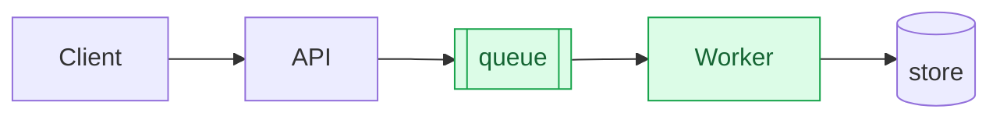

# Writing a pull request description

A portable convention. Nothing here is specific to this repository, this
language, or this stack; it is written to be copied into a front-end app, a
backend service, a mobile app, a parser, a data pipeline, a CLI, or an
infrastructure repo unchanged.

- **The template:** [`pull-request-template.md`](pull-request-template.md)
- **This file:** why each section exists, and what it looks like in different
  kinds of codebase.

---

## Adopting it in a new repo

From the directory holding this file:

```bash
mkdir -p <target-repo>/.github
cp pull-request-template.md <target-repo>/.github/PULL_REQUEST_TEMPLATE.md
```

Then edit the two `‹…›` placeholders (the test command and the repo-specific
review gate) and delete the adoption banner at the top. That is the whole
setup. GitHub and GitLab both pick the file up automatically.

Finally, add one line to whatever file your AI assistant and your contributors
read first (`CLAUDE.md`, `AGENTS.md`, `CONTRIBUTING.md`):

> **The PR template is not optional.** Start from
> `.github/PULL_REQUEST_TEMPLATE.md`, never free-hand. Section-by-section guide:
> ‹path to this README in the target repo›.

Without that line the template is a suggestion, and suggestions decay. See
[Why this exists](#why-this-exists).

---

## The six sections

Four are mandatory. Two are conditional and should be **deleted**, header and
all, when they have nothing to say. A section reading "N/A" costs a reader the
same attention as a real one and returns nothing.

| Section | When | Answers |
|---|---|---|
| 👥 High-level summary | Always | Why should anyone care? |
| 📐 Before / after diagram | Flow changed | What moved? |
| 📸 Visible changes | A human can see it | What does it look like now? |
| 📋 What changed | Always | What did you decide, and why? |
| ✅ Test plan | Always | How do you know it works? |
| 🤖 Review | Always | Has this been challenged? |

---

### 👥 High-level summary

Three to five sentences someone outside the codebase could follow. No
identifiers, no file names, no jargon.

**The test:** could a competent person from another department read it and
correctly say who is better off? If explaining the change requires naming a
function, you may understand its mechanism but not yet its purpose.

| Stack | Weak (mechanism) | Strong (purpose) |
|---|---|---|
| Front-end | "Memoises the selector and splits the bundle at the route boundary." | "The settings page took about four seconds to appear on a mid-range phone, so people tapped twice and created duplicate records. It now appears almost immediately." |
| Backend | "Adds an idempotency key to the charge endpoint." | "If a payment request was sent twice (a flaky network, an impatient tap), we could charge the customer twice. Now the second attempt returns the first result instead of taking more money." |
| Mobile | "Moves DB writes off the main thread via a background dispatcher." | "The app froze for a moment whenever you saved a note, and long notes could freeze it long enough for the phone to kill it. Saving no longer blocks anything." |
| Parser / pipeline | "Adds a discriminated union on the adapter sink." | "One of our sources supplies whole sentences, not single words. We had been feeding it into the machine that handles single words, where every sentence was thrown away. Sentences now have their own shelf, and they cannot end up in the dictionary by accident." |
| Infrastructure | "Pins the runner image and adds a concurrency group." | "Two deploys starting at once could overwrite each other, and the result depended on which finished last. Only one can run at a time now." |

This is the section most often skipped and, for most readers, the only one
they read. Write it last, when you understand what you did.

---

### 📐 Before / after diagram *(conditional)*

Keep it only when a box or an arrow **moves**: a data path, a request
lifecycle, screen-to-screen navigation, a build stage, a state machine. A
behaviour change inside one existing box does not need a picture.

The distinction, concretely: making the search inside a `Query` service twice
as fast moves nothing: no diagram. Putting a cache *between* `Client` and
`Query` adds a box and re-routes an arrow: diagram. Ask whether a reader's
mental map of the system is now wrong, not whether the change was significant.

The same test applies to a node's own label. If it names stages, a cadence or a
guarantee (`pypdf → segment → parse`, `weekly cron`, `one row per record`) and
the change falsifies that text, the map is wrong even though nothing moved. Ask
what each box *claims*, not just where it sits.

Always show **before, then after**: a single "after" diagram describes the
world; a pair shows the change. Highlight the new nodes with a Mermaid class so
the delta is visible without diffing two images by eye.



If the repo keeps an architecture document, update it in the same PR. Two
diagrams that disagree are worse than one that is merely out of date, because
neither can be trusted.

---

### 📸 Visible changes *(conditional)*

"Visible" is not only a browser. Keep this section for a web page, a mobile
screen, a CLI's output, a generated report or export, an email, a dashboard
panel, or a log format someone reads on purpose.

- **Web / mobile:** before-and-after images in a two-column table. For mobile,
  state the device and OS version; a screenshot without them cannot be
  reproduced.
- **CLI / logs / generated text:** paste the two outputs in fenced blocks
  rather than screenshots. Text diffs, survives forever, and is searchable.
  Paste **the delta, not the dump**: for a structured output such as CSV or
  JSON, show the few lines that changed plus enough surrounding rows to locate
  them. A reviewer scrolling ten kilobytes of unchanged payload is being asked
  to run `diff` by eye, and will not.
- **Host images so they outlive the branch.** Attach them to the PR, or
  reference a committed file **by commit SHA**, never by branch name; a
  branch-pinned image 404s the moment the branch is deleted.

If your repo commits screenshots, replace them **in place**. Version history
already keeps the old ones; an `-old` copy beside the current one is a file
nobody will ever delete.

---

### 📋 What changed

One bullet per decision a reviewer might question, not one per file. The diff
already lists the files; it cannot list your reasoning.

Include, explicitly:

- the road not taken, and why
- the constraint that forced the shape of the change
- anything that looks wrong but is deliberate

A reviewer who has to reconstruct your reasoning will either reconstruct it
wrongly or approve without understanding. Both cost more than the sentence you
would have written.

---

### ✅ Test plan

Evidence, not intentions. Every ticked box names something you observed.

| Stack | What counts as evidence |
|---|---|
| Front-end | Component/interaction tests; the rendered result checked at real breakpoints; a measured metric (bundle size, LCP) before → after |
| Backend | Unit + contract tests; the endpoint actually called with its real payload; migration applied and rolled back on a throwaway database |
| Mobile | Tests on a named device/OS; the affected screen driven by hand; a cold-start or frame-time number, not "feels faster" |
| Parser / pipeline | Golden fixtures for the formats you claim to support, including malformed input; a dry run over **real** upstream data with counts stated |
| Infrastructure | The pipeline actually executed; the failure path induced on purpose, not assumed |

Five rules, in order of how often they are broken:

1. **Never tick a box you did not verify.** One aspirational `[x]` makes every
   other tick unreliable: the section stops being evidence and becomes
   decoration. An honest `[ ]` with a reason is worth more.
2. **Numbers must be measured.** "Improves performance" is not a test plan;
   "p95 3.2s → 0.4s over 500 requests" is.
3. **Test at the boundary that matters.** Assert on what flows downstream, not
   only on the helper you just wrote. A helper can be perfect while nothing
   calls it correctly.
4. **A green suite is not evidence when a test encodes the bug.** If you
   changed or deleted a test, say why it was wrong. Tests asserting broken
   behaviour pass loudly.
5. **Docs- and config-only PRs still get a test plan.** Name the CI jobs and
   say what you checked the claims against; a document asserting a wrong
   number is that PR's failure mode, and it will be believed for months.

---

### 🤖 Review

Whatever reviews your code (a person, an automated reviewer, or both), the
convention is the same: **a new push invalidates the previous review.** Re-read
it after every push.

**Reply on the PR itself**, not only in a chat window. The audit trail has to
live where the next person will look. One row per finding, with an unambiguous
verdict:

| Verdict | Meaning |
|---|---|
| ✅ **Applied** | Landed in this push; cite `file:line` |
| 🚫 **Skipped** | Will *not* be done. Rationale required: false positive, out of scope, or intentional |
| ⏳ **Deferred** | Real, but not here; link the follow-up |
| 💬 **Acknowledged** | For "this looks good" notes; no action expected |

Vague verdicts ("Considered", "Noted", "Will look into it") defeat the
purpose. A maintainer scanning the table must be able to see what did *not*
ship without reading prose.

#### Keep it to one comment

This applies to whoever answers reviews **repeatedly and mechanically**: an
assistant or a workflow. A human reviewing once is not obliged to consolidate;
the verdict vocabulary above is the part that applies to everyone.

Use one reply comment per PR, **edited in place** across review rounds, not a
new one each round; four stacked near-identical replies bury the thread and
make it impossible to see what the current position on a finding is.

Find it with an HTML-comment marker at the **start** of the body. Two traps,
both hit for real:

- **Match with `startswith`, never `contains`.** An automated reviewer that
  quotes your marker (reviewing a diff that introduces it, say) will match a
  `contains` filter, and you will overwrite the review.
- **Count the matches before patching.** Patch only when exactly one comment
  matches; abort otherwise. Overwriting the wrong comment is silent.
- **Exclude the reviewer's own account** from the match, so the filter can only
  ever select your comment. Identify it by author, not by which marker you
  expect it to carry; that expectation is what fails.

The marker is machine-written. Do not hand-type it into a comment.

#### Recovering a clobbered comment

If you do overwrite one, every previous body is retained by GitHub and
recoverable; restore it before doing anything else. The REST API does not
expose this; GraphQL does:

```bash
gh api graphql -f query='
{
  repository(owner:"OWNER", name:"REPO") {
    pullRequest(number:NN) {
      comments(first:20) {
        nodes {
          databaseId
          userContentEdits(first:20) {
            nodes { editedAt editor { login } diff }
          }
        }
      }
    }
  }
}'
```

`userContentEdits` returns the prior bodies newest-first. Take the last one
written by the original author, write it to a file, and restore with:

```bash
gh api -X PATCH repos/OWNER/REPO/issues/comments/<id> -F body=@restore.md
```

Then verify the restored body byte-length against what you recovered, and post
your own reply as a **separate** comment.

**Verify each finding against the source before applying it.** Automated
reviewers read a diff without context and are confidently wrong often enough
that applying findings unchecked will introduce bugs. Recent real examples from
this repo: a reviewer reported a missing guard that already existed six lines
above the diff hunk; misread an empty array literal as a JSON object and
predicted a constraint violation that no constraint could produce; and asked
for a changelog entry in a repo with no changelog. All three were plausible
and all three were wrong. Skipping a finding is legitimate; skipping it
*silently* is not.

---

## Anti-patterns

| Pattern | Why it fails |
|---|---|
| "N/A" under a conditional heading | Costs a reader the same attention as content, returns nothing. Delete the section. |
| High-level summary full of identifiers | It is a second technical summary, not one anyone can read. |
| Ticking every box because the suite is green | A green suite proves the tests you have pass, not that the change works. |
| One bullet per changed file | The diff already does this. Explain decisions, not inventory. |
| Screenshot linked to a branch path | 404s the moment the branch is deleted. Pin to a commit SHA. |
| Retrofitting the description after merge | Reviewers already made their decision with worse information. |

---

## Why this exists

This convention is not theoretical. The example below is local to the
repository this guide was first written for (the PR
numbers will not resolve anywhere else), but the failure mode is not local at
all, which is why the guide travels.

There, the template existed but was described in the contributor guide only as
a formatting tip (which sections to omit) and never as a requirement.

Eight consecutive pull requests (#33–#40) were then written free-hand. Every
one of them shipped without a high-level summary and without a test plan. All
eight had to have their descriptions reconstructed after merge, at which point
the reviewers had already made their decisions with worse information than they
should have had. Five older PRs also carried escaped backticks that rendered as
visible backslashes, because each description was hand-assembled rather than
copied from a known-good file.

Two lessons, both encoded above:

1. **A convention that is not stated as mandatory will be treated as
   optional**, including, and especially, by an AI assistant reading the
   contributor guide before opening a PR.
2. **Free-hand descriptions drift.** Copying a file does not.
