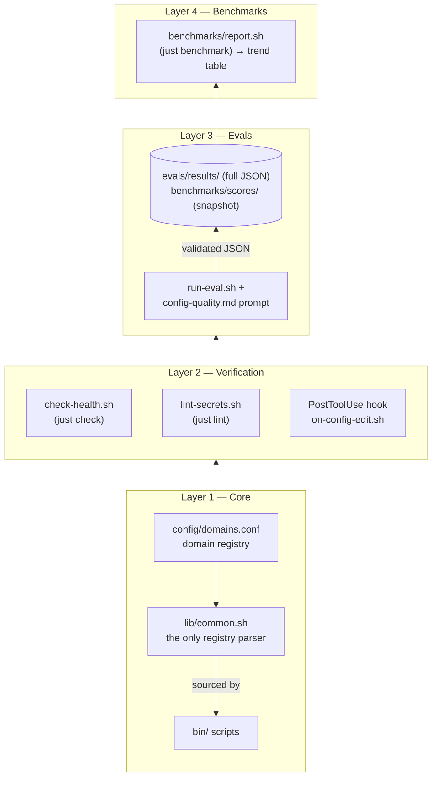

# Architecture

The agent-config-harness repo is a four-layer pipeline for AI configuration. Each layer has a single responsibility and a clear contract with the layer below.



---

## Layer 1 — Core

The plumbing. Everything else builds on this.

### Domain Registry (`config/domains.conf`)

Single source of truth for which domains exist and which files each one manages. INI-style, comment-friendly:

```ini
# domain = workspace_subdir : files_to_manage
# (CLAUDE.md is canonical; sibling AGENTS.md — and duplicate .cursorrules —
#  are symlinks -> CLAUDE.md and are not listed)
mobile          = workspace/mobile          : AGENTS.md>project/CLAUDE.md, CLAUDE.md, .cursorrules
web-react       = workspace/web-react, workspace/web : CLAUDE.md
backend-node    = workspace/backend-node    : CLAUDE.md
data-extraction = workspace/data-extraction : CLAUDE.md
```

Adding a domain is a one-line change here plus a new workspace folder. **No scripts hardcode domain names.**

### Shared Library (`lib/common.sh`)

Sourced by every script. Provides:

- `REPO_ROOT`, `DOMAINS_CONF` — absolute paths resolved once
- `log_info / log_ok / log_warn / log_error` — consistent output
- `require <tool> [hint]` — dependency guards
- `list_domains`, `get_domain_workspace`, `get_domain_files`, `domain_exists` — registry readers
- `detect_domain <project_path>` — maps a path to a domain by substring match on path components

This is the only place where the registry format is parsed. Adding a field to the registry means changing one function.

### Scripts (`bin/`)

| Script | Purpose |
|---|---|
| `setup.sh` | Link configs and skills globally; install git aliases and pre-push hook |
| `detect-domain.sh` | CLI wrapper around `detect_domain` |
| `sync-back.sh` | Copy project changes → branch → commit → PR |
| `stealth.sh` / `unstealth.sh` | Replace tracked file with stealth symlink / restore real file |
| `materialize.sh` | Stage stealth content as real file in host repo |
| `check-health.sh` | Health-check global links and every registered domain |
| `lint-secrets.sh` | Scan for secret value patterns (not just word matches) |
| `on-config-edit.sh` | PostToolUse hook handler — validates + suggests audit |
| `git-stealth.sh` | Backs `git spull` / `git scommit` aliases |
| `open-release-pr.sh` | Open or refresh the standing `develop` → `main` release PR. Never merges |
| `open-backmerge-pr.sh` | Open or refresh the `main` → `develop` PR that closes the post-release gap. Never merges |
| `eval-action.sh` | Entry point for the "score your config in CI" GitHub Action (`action.yml`) |
| `marketplaces.sh` | Install skills from the marketplaces registered in `config/marketplaces.conf` |
| `validate-skills.sh` | Validate the structure of any skills tree (incl. marketplace-installed) |
| `install-external-skills.sh` | Install the third-party skill bundles in `config/external-skills.conf` |
| `impeccable-hooks.sh` | Install the impeccable design hook into frontend projects |

Every script:
- Starts with `set -euo pipefail`
- Sources `lib/common.sh`
- Uses the shared logging functions
- Reads the domain registry — never hardcodes paths

One deliberate exception: `bin/eval-action.sh` is the GitHub Action entry
point and runs in a repo that vendors nothing, so it stays self-contained
rather than sourcing `lib/common.sh`.

---

## Layer 2 — Verification

Fast, always-on validation.

### Static Checks

- `just check` runs `check-health.sh` — confirms every global symlink is valid and every domain's managed files exist.
- `just lint` runs `lint-secrets.sh` — scans for actual secret value patterns (e.g. `API_KEY=abc123def`), avoiding false positives on the bare word "secret" in documentation.
- `just test` runs the `bats` suite — covers detection, registry reading, sync, setup, and the hook handler.

### Claude Code Hook

Optional. After `just setup`, copy `config/templates/claude-hooks.json` to `.claude/settings.json` to enable the `PostToolUse` hook:

1. Claude makes an `Edit` or `Write` call.
2. The hook runs `on-config-edit.sh`.
3. If the edited file isn't a managed config (not in `config/`, `workspace/`, or `user-dev/`), the handler exits silently.
4. If it is, the handler runs `just check && just lint`. Failure → stops Claude with a clear error. Success → prints a suggested follow-up (`/agent-config-audit`, `claude-md-improver`, `just eval`).

---

## Layer 3 — Evals

AI-powered quality scoring.

### Inputs

- The full file stack for a domain (the `CLAUDE.md` guide and `.cursorrules`; `AGENTS.md` is a symlink to `CLAUDE.md`, so it is not scored separately).
- The scoring prompt at `evals/prompts/config-quality.md` (which doubles as documentation — it's the spec for what "good" looks like).

### Output

A JSON object validated against `evals/eval-schema.json`. Contains:
- Five 1–5 scores
- Total, percentage, grade (A–F)
- Up to 5 findings with `dimension`, `file`, `section`, `issue`, `recommendation`

Results land in `evals/results/` (full output) and `benchmarks/scores/` (compact snapshot).

See [evaluation.md](evaluation.md) for the rubric.

---

## Layer 4 — Benchmarks

`just benchmark` reads every JSON file under `benchmarks/scores/` and renders a per-domain trend table. New score files accumulate; you can see drift over time.

`benchmarks/scores/` is gitignored by default. Use `just benchmark-commit` to deliberately snapshot a state.

---

## Invariants

These are non-negotiable design rules. Don't break them in PRs.

1. **No script hardcodes a domain name or workspace path.** Read from the registry.
2. **Scripts source `lib/common.sh`** and use its logging functions. The one
   deliberate exception is `bin/eval-action.sh` — see Layer 1.
3. **`main` is protected.** No direct pushes. PR required.
4. **Tests pass before merge.** `bats tests/` and `shellcheck` both green.
5. **Lint runs without false positives.** If lint catches legitimate doc content, fix the pattern, not the doc.
